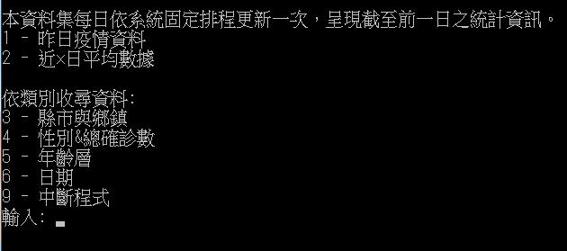

# Covid19_Tracker_Taiwan
The program categorises and summarizes Covid-19 data in Taiwan.


## What is Covid19_Traker_Taiwan?
The program gets data using an API and displays it in different catagories.  
Api is provided by [政府資料開放平台](https://data.gov.tw/dataset/120711)衛生福利部疾病管制署.  
The database is updated everyday with **yesterdays** data as the lastest.  
An example of a json object:
```
{
    "確定病名": "嚴重特殊傳染性肺炎",
    "個案研判日": "2020/01/22", 
    "縣市": "空值", 
    "鄉鎮": "空值", 
    "性別": "女", 
    "是否為境外移入": "是", 
    "年齡層": "55-59", 
    "確定病例數": "1"
}
```
The program can be split to 2 sections.  
1. Display a summary of yesterday's figures or a summary of an averaged case numbers for timedelta x days.  
2. Order each Covid-19 case according to their 縣市鄉鎮, 性別&總確診, 年齡層 or 個案研判日. The program will take user's input as the date of when the count of cases will start. For example, entering `2020/05/05` will count cases from `2020/05/05` to yesterday. Entering 0 as the date will start the count at the first recorded Covid-19 case.

After displaying the results, the user can choose to write the results to a **.txt** file.

## Getting Started
Clone or download this repository.

### Prerequisites
 - [requests](https://docs.python-requests.org/en/master/)
  ```
  $ pip install requests
  ```

<!-- USAGE EXAMPLES -->
## How to use
Run this program as any other python code or double click on **.exe** file.  
However, each input must be in the correct range since this program does not handle errors.  
Enter 1~6 as input corresponding to the list of context.  

For choice 2, enter anthor input as x.  


For choice 3 ~ 6, enter a date with format `yyyy/mm/dd`, or enter `0` for all of the data.  


After seeing the results, the user can choose to write the results to a **.txt** file.  


Enter 9 to exit the program.

<!-- CONTRIBUTING -->
## Contributing
Contributions are what make the open source community such an amazing place to be learn, inspire, and create. Any contributions you make are **greatly appreciated**.

1. Fork the Project
2. Create your Feature Branch (`git checkout -b feature/AmazingFeature`)
3. Commit your Changes (`git commit -m 'Add some AmazingFeature'`)
4. Push to the Branch (`git push origin feature/AmazingFeature`)
5. Open a Pull Request


<!-- LICENSE -->
## License
Distributed under the MIT License. See `LICENSE` for more information.

<!-- CONTACT -->
## Contact
Email - josephhuang08@gmail.com
